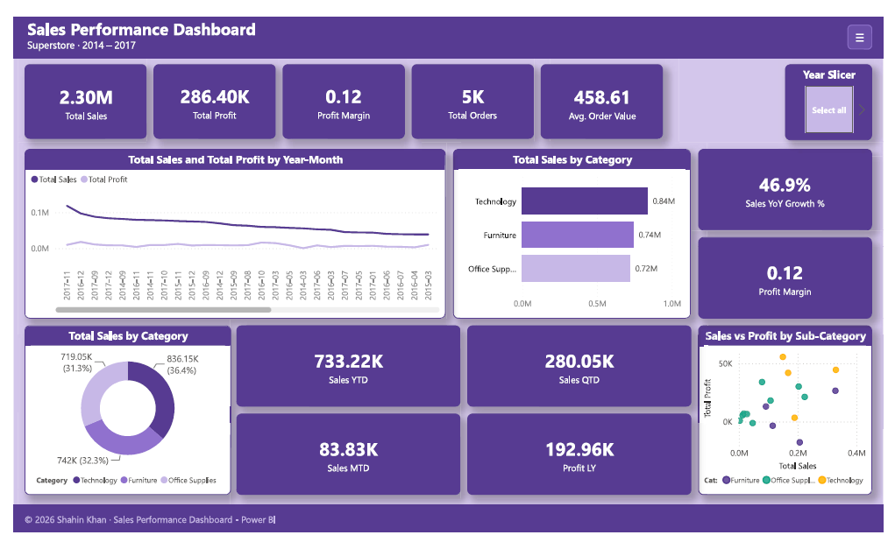
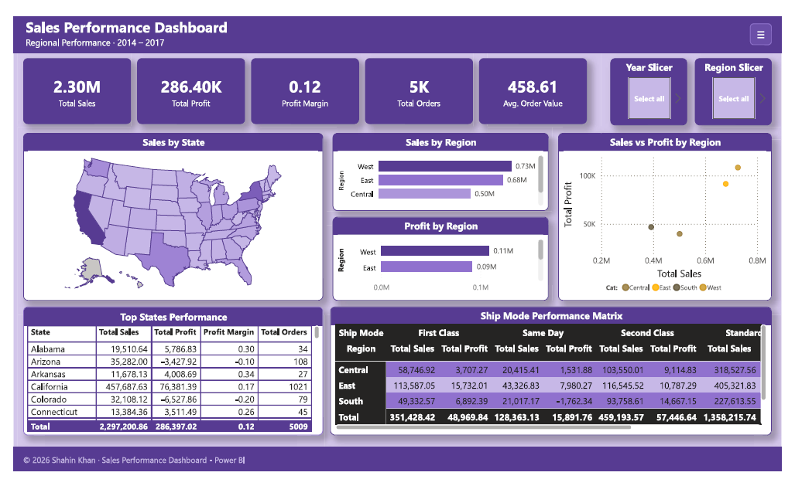
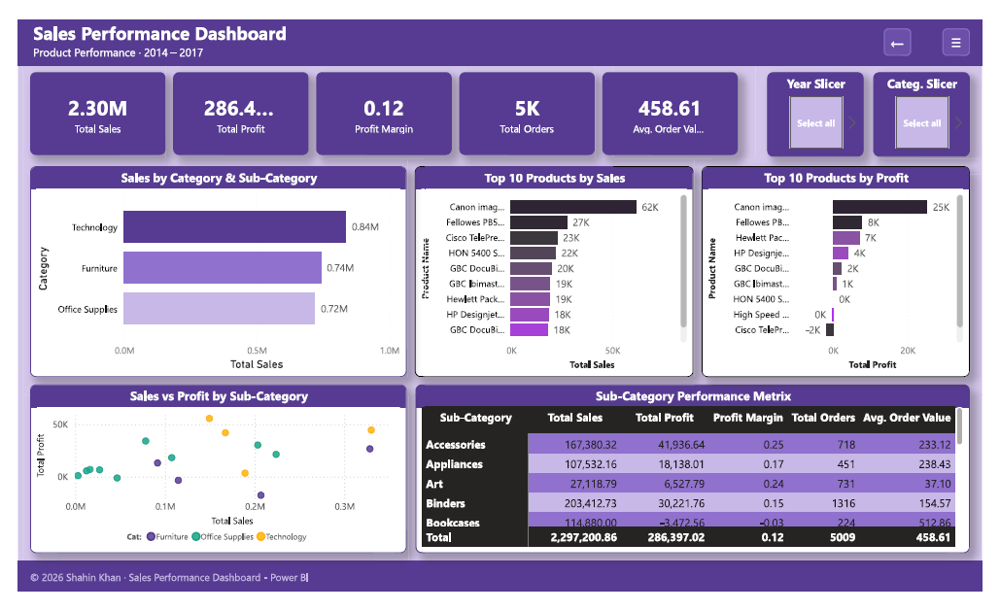
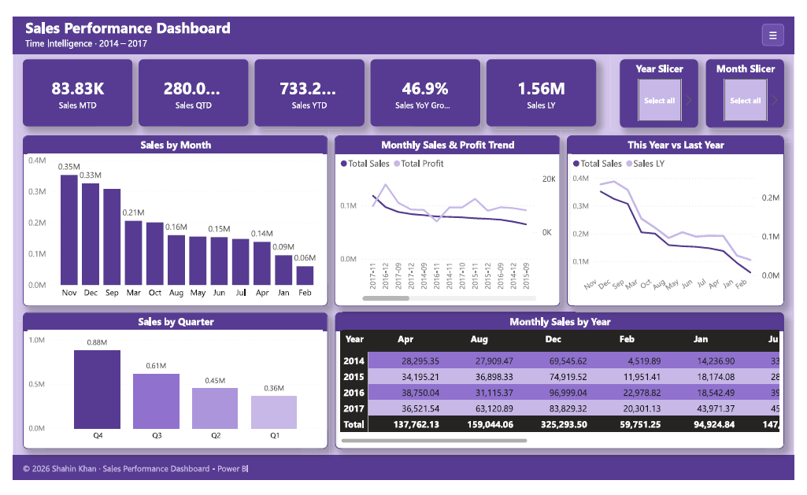

# Sales Performance Dashboard — Power BI

> An end-to-end interactive sales analytics solution built on the Superstore dataset — covering revenue trends, regional performance, product analysis and time intelligence across 4 years of US retail data.

**[View Live Interactive Dashboard →](https://app.powerbi.com/view?r=eyJrIjoiOTkzZTgxZDQtOTUxNC00NWVhLTliOTUtMjBjZDk4NjlmODM1IiwidCI6ImJhY2JkYWMyLWFkODAtNGM3NC04NTk2LWQyZDA4NjExNWYwMyJ9)**

[](https://app.powerbi.com/view?r=eyJrIjoiOTkzZTgxZDQtOTUxNC00NWVhLTliOTUtMjBjZDk4NjlmODM1IiwidCI6ImJhY2JkYWMyLWFkODAtNGM3NC00NTk2LWQyZDA4NjExNWYwMyJ9)

---

## Key Metrics

| Metric | Value |
|--------|-------|
| Total Revenue | $2.3M |
| Total Profit | $286K |
| Profit Margin | 12.5% |
| Total Orders | 5,009 |
| Top Region | West |
| Top Category | Technology |
| Top State | California |
| Period | 2014 – 2017 |

---

## Table of Contents

- [Business Problem](#business-problem)
- [Dataset Overview](#dataset-overview)
- [Objectives](#objectives)
- [Data Cleaning](#data-cleaning)
- [Data Modelling](#data-modelling)
- [DAX Measures](#dax-measures)
- [Dashboard Pages](#dashboard-pages)
- [Key Insights](#key-insights)
- [Business Recommendations](#business-recommendations)
- [Challenges & Learnings](#challenges--learnings)
- [Screenshots](#screenshots)
- [Tools Used](#tools-used)
- [Project Structure](#project-structure)
- [Licence](#licence)
- [Author](#author)

---

## Business Problem

A retail company operating across four US regions needs to understand where revenue is being generated, which products are driving profit, and how performance changes over time. Without clear visibility into these dimensions, business leaders make decisions based on instinct rather than evidence.

This dashboard answers four core business questions:

- Which regions and states generate the most value?
- Which product categories have the highest margins — and which are losing money despite high sales?
- Are we growing year over year?
- When are our peak selling periods and how do we capitalise on them?

---

## Dataset Overview

| Property | Detail |
|----------|--------|
| Source | Kaggle / Tableau Sample Data |
| Rows | 9,994 orders |
| Columns | 21 fields |
| Period | January 2014 – December 2017 |
| Geography | USA — 4 regions, 49 states, 531 cities |
| Categories | Furniture, Office Supplies, Technology |
| Sub-categories | 17 product sub-categories |

---

## Objectives

- Build a professional, interactive dashboard that a non-technical executive could use to make confident business decisions
- Demonstrate core Power BI skills — data modelling, DAX, time intelligence, drill-through and custom navigation
- Surface actionable insights rather than just presenting numbers
- Design a visually consistent experience that reflects professional dashboard standards

---

## Data Cleaning

All cleaning was performed in Power Query before any analysis:

- Changed `Order Date` and `Ship Date` from Text → Date type for time intelligence to work correctly
- Changed `Postal Code` from Number → Text to prevent leading zeros being stripped
- Removed `Row ID` column — not needed for analysis
- Verified `Sales`, `Profit`, `Discount` and `Quantity` are Decimal Number type
- Confirmed no missing or null values across key columns

---

## Data Modelling

A dedicated Date Table was created using DAX — required for time intelligence functions to work correctly. It was marked as the official date table and connected to the Orders table via a one-to-many relationship on `Order Date`.

```dax
Date Table = 
ADDCOLUMNS(
    CALENDAR(DATE(2014,1,1), DATE(2017,12,31)),
    "Year",        YEAR([Date]),
    "Month Num",   MONTH([Date]),
    "Month Name",  FORMAT([Date], "MMMM"),
    "Month Short", FORMAT([Date], "MMM"),
    "Quarter",     "Q" & QUARTER([Date]),
    "Year-Month",  FORMAT([Date], "YYYY-MM")
)
```

Measures were organised into three dedicated tables — `Core Sales Measures`, `Time Intelligence Measures` and `Ranking Measures` — keeping the model clean and easy to navigate.

---

## DAX Measures

### Core Sales

```dax
Total Sales     = SUM(Orders[Sales])
Total Profit    = SUM(Orders[Profit])
Total Orders    = DISTINCTCOUNT(Orders[Order ID])
Profit Margin   = DIVIDE([Total Profit], [Total Sales], 0)
Avg Order Value = DIVIDE([Total Sales], [Total Orders], 0)
```

### Time Intelligence

```dax
Sales LY         = CALCULATE([Total Sales], SAMEPERIODLASTYEAR('Date Table'[Date]))
Sales YoY Growth = DIVIDE([Total Sales] - [Sales LY], [Sales LY], 0)
Sales YTD        = TOTALYTD([Total Sales], 'Date Table'[Date])
Sales MTD        = TOTALMTD([Total Sales], 'Date Table'[Date])
Sales QTD        = TOTALQTD([Total Sales], 'Date Table'[Date])
```

### Ranking

```dax
Product Rank = RANKX(ALL(Orders[Product Name]), [Total Sales], , DESC, DENSE)
State Rank   = RANKX(ALL(Orders[State]),        [Total Sales], , DESC, DENSE)
```

---

## Dashboard Pages

### Page 1 — Executive Overview
KPI cards, revenue and profit trend line chart, top 5 products bar chart, sales by category donut chart, sales vs profit scatter plot, MTD / QTD / YTD cards.

[](https://app.powerbi.com/view?r=eyJrIjoiOTkzZTgxZDQtOTUxNC00NWVhLTliOTUtMjBjZDk4NjlmODM1IiwidCI6ImJhY2JkYWMyLWFkODAtNGM3NC04NTk2LWQyZDA4NjExNWYwMyJ9)

### Page 2 — Regional Performance
USA filled map, sales and profit by region bar charts, top 10 states performance table, regional sales vs profit scatter plot.

[](https://app.powerbi.com/view?r=eyJrIjoiOTkzZTgxZDQtOTUxNC00NWVhLTliOTUtMjBjZDk4NjlmODM1IiwidCI6ImJhY2JkYWMyLWFkODAtNGM3NC04NTk2LWQyZDA4NjExNWYwMyJ9)

### Page 3 — Product Performance
Top 10 products by sales, top 10 products by profit, sub-category performance matrix with conditional formatting, sales vs profit scatter by sub-category. Drill-through available from Page 2.

[](https://app.powerbi.com/view?r=eyJrIjoiOTkzZTgxZDQtOTUxNC00NWVhLTliOTUtMjBjZDk4NjlmODM1IiwidCI6ImJhY2JkYWMyLWFkODAtNGM3NC04NTk2LWQyZDA4NjExNWYwMyJ9)

### Page 4 — Time Intelligence
Monthly sales and profit trend, this year vs last year comparison, sales by month column chart, sales by quarter, monthly performance heatmap matrix.

[](https://app.powerbi.com/view?r=eyJrIjoiOTkzZTgxZDQtOTUxNC00NWVhLTliOTUtMjBjZDk4NjlmODM1IiwidCI6ImJhY2JkYWMyLWFkODAtNGM3NC04NTk2LWQyZDA4NjExNWYwMyJ9)

---

## Key Insights

| # | Insight | Detail |
|---|---------|--------|
| 1 | Technology leads in profit | Highest margin category — most efficient by far |
| 2 | West region dominates | California alone accounts for 20%+ of total revenue |
| 3 | Tables sub-category losing money | Negative profit despite high sales — heavy discounting destroying margins |
| 4 | Strong Q4 seasonality | November and December consistently drive peak revenue |
| 5 | Consistent YoY growth | Revenue grew every year from 2014 to 2017 |
| 6 | Furniture lowest margin | High discounts and shipping costs significantly reduce profitability |

---

## Business Recommendations

1. **Reduce discounting on Furniture** — cap maximum discount at 15% across Tables and Bookcases
2. **Expand Technology product range** — highest margin category with consistent growth and the best ROI potential
3. **Replicate West region strategy in Central** — weakest performing region with significant untapped revenue potential
4. **Launch Q1 and Q2 promotions** — address the seasonal revenue dip in the first half of the year
5. **Review or discontinue Tables** — negative profit sub-category; consider repricing or removal from the catalogue
6. **Invest in California and New York retention** — top two states by revenue; loyalty programmes would protect this base

---

## Challenges & Learnings

**Time intelligence requires a proper Date Table**
Early in the project `SAMEPERIODLASTYEAR` was returning blank results. The fix was marking the Date Table correctly and ensuring the relationship was set to active — a fundamental Power BI data modelling lesson.

**Bookmarks require discipline**
Building the hamburger navigation using Bookmarks taught me how Power BI manages visual state. Every element's visibility must be intentionally set before capturing a bookmark state — learned through several failed iterations.

**Design matters as much as data**
A technically correct dashboard that looks unprofessional loses credibility immediately. Investing time in consistent colour usage, typography and layout alignment significantly elevated the final output.

**Drill-through adds real analytical depth**
Right-clicking a region to drill directly into product-level detail for that region transforms a static report into a genuine investigative tool that a business analyst would actually use.

---

## Screenshots

| Executive Overview | Regional Performance |
|-------------------|---------------------|
|  |  |

| Product Performance | Time Intelligence |
|--------------------|------------------|
|  |  |

---

## Tools Used

| Tool | Purpose |
|------|---------|
| Power BI Desktop (June 2026) | Dashboard development |
| DAX | Measures and calculations |
| Power Query / M Language | Data cleaning and transformation |
| Microsoft Excel | Source data format |
| Power BI Service | Publishing and sharing |
| DAX Studio | Measure testing and optimisation |
| Bookmarks & Drill-through | Navigation and interactivity |
| GitHub | Version control and documentation |

---

## Project Structure

```
superstore-sales-dashboard/
│
├── README.md
├── LICENSE
│
├── report/
│   └── Sales_Performance_Dashboard.pdf
│
├── dataset/
│   └── superstore.xlsx
│
└── screenshots/
    ├── 01-executive-overview.png
    ├── 02-regional-performance.png
    ├── 03-product-performance.png
    ├── 04-time-intelligence.png
    └── dashboard-demo.gif
```

---

## Licence

This project is licensed under the **MIT License** — see the [LICENSE](LICENSE) file for details.

The Superstore dataset is a publicly available sample dataset provided by Tableau and available on Kaggle. It is used here for educational and portfolio purposes only.

---

## Author

**Shahin Khan** — Data Analyst & Business Development Manager, Madrid, Spain

- Portfolio: [shahinkhan.net](https://www.shahinkhan.net)
- LinkedIn: [linkedin.com/in/shahin-in](https://www.linkedin.com/in/shahin-in/)
- GitHub: [github.com/shahinkhan-git](https://github.com/shahinkhan-git)
- Contact: [shahinkhan.net/contact](https://www.shahinkhan.net/contact/)

---

*If you found this project useful, consider giving it a ⭐ on GitHub.*
